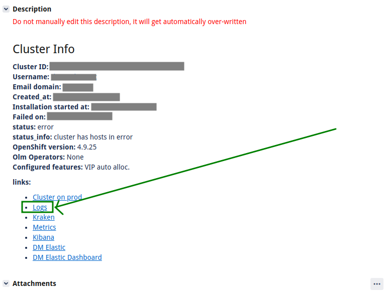

AITRIAGE logs to Loki
====

These two scripts help with triaging assisted-installer failures. Looking into separate files makes it complicated to correlate particular events from multiple sources - i.e. bootkube log and infraenv/cluster events.

# Requirements

- Podman
- Python 3
- Red Hat VPN connection

# Usage

## Running Loki+Promtail+Grafana

`./run-loki.py` runs Loki+Promtail+Grafana stack preconfigured to parse AITRIAGE logs collected for particular failure. It runs as Podman pod locally, reading data from `/tmp/aitriage-loki`.

## Unpacking ticket logs

`unpack.py` script fetches files from logs storage e.g. - `http://assisted-logs-collector.usersys.redhat.com/files/<timestamp>_<cluster_id>`

The original link can be retrieved from the AITRIAGE ticket's description "logs" as seen here:

It will unpack stored tars and copy it to `/tmp/aitriage-loki`. Promtail running in the background parses the files and loads them in Loki. Grafana is used to query logs via cluster ID / event source / systemd service etc.
